[< BACK ](../../overview/README.md)

## Containers

- [Docker run](#Docker-run)
- [Container lifecycle](#Container-lifecycle)
- [Detached mode](#Detached-mode)
- [Ports mapping](#Ports-mapping)
- [Environment variables](#Environment-variables)
- [Logs & stats](#Logs-&-stats)
- [Quiz](#Quiz)

A container is a runnable instance of an image. You can manage containers (create/deleted or start/stop) using command line or Docker Desktop and create many containers based on same image. Those instances are isolated from each other but share and run on same host kernel making them lighweight, limiting the resources but also causing potential security risks - Docker by default runs all processes as ROOT user (one of the reasons why production containers should always be run under non-privileged user context). Running containers are reachable from the host system. By default containers can communicate between each other trough same host bridge network and can access to external networks using the host machine’s network connection (more about networking in 'Networks' section). 

Containers are sateless and do not have data persistence - once deleted, the data that is not stored under shared volume(s) will be lost.

### Docker run

In previous section we created our first containers using the command `docker run`. Behind the scenes much more happens: 

- Docker pulls it from the registry, if the image does not exist locally
> *Command:*  
> `docker image pull [OPTIONS] NAME[:TAG|@DIGEST]`
>
> *For more information:*  
> `docker image --help`

- Docker creates a new writable container layer over the specified image
> *Command:*  
> `docker create [OPTIONS] IMAGE [COMMAND] [ARG...]`
>
> *For more information:*  
> `docker create --help`

- Docker starts the container

> *Command:*  
> `docker start [OPTIONS] CONTAINER [CONTAINER...]`
>
> *For more information:*  
> `docker start --help`


This flow was of course simplified as Docker creates also network interface, prepares the system files, initializes volumes and much more. 

---

### Container lifecycle

In this chapter we will go through Container's lifecycle and use the `create`, `start`, `stop` and `kill` commands.
We will also follow the steps covered in 'Image' section you are familiar with:

- [ ] Prepare the Dockerfile
- [ ] Edit Dockerfile
- [ ] Build an Image
- [ ] Create container
- [ ] Start container
- [ ] Stop/Kill container
- [ ] Pause/Unpause container

---
#### Prepare the Dockerfile

1. create a new `docker_lifecycle` folder
2. create blank `Dockerfile` file inside `docker_lifecycle`

***Progress:***
- [x] Prepare the Dockerfile
- [ ] Edit Dockerfile
- [ ] Build an Image
- [ ] Create container
- [ ] Start container
- [ ] Stop/Kill container
- [ ] Pause/Unpause container

---

#### Edit Dockerfile
The image will be based on Ubuntu image pulled from Docker Official Images registry. 

```
FROM ubuntu
MAINTAINER Kamil Kubicki <contact@kamil-kubicki.com>  
RUN apt-get update && apt-get install -y iputils-ping
RUN useradd -ms /bin/bash kubik
USER kubik
ENTRYPOINT ["ping","-c","3"]
CMD ["localhost"]
```
<cite>Source: [Dockerfile](src/dockerfiles/Dockerfile_Ubuntu)</cite>

* FROM : base `ubuntu:<version>` image that our template relies on
* MAINTAINER : contact information for the Dockerfile’s author
* RUN : Run the command inside your image filesystem (here updates/installs the package lists required for ping command and switches ROOT user as no longer needed to run the container with less privileges)  
    * -s /bin/bash : set /bin/bash as login shell of the new account
    * -m : create the user’s home directory
* ENTRYPOINT : configure the container that will run as an executable
* CMD : Run the specified command within the container - CMD is used to provide default arguments for the ENTRYPOINT instruction and both define the lifetime of a container (container is as long up as the process is running inside, then exits)

***Progress:***
- [x] Prepare the Dockerfile
- [x] Edit Dockerfile
- [ ] Build an Image
- [ ] Create container
- [ ] Start container
- [ ] Stop/Kill container
- [ ] Pause/Unpause container

---

#### Build an Image

> docker build -t docker_lifecycle .  

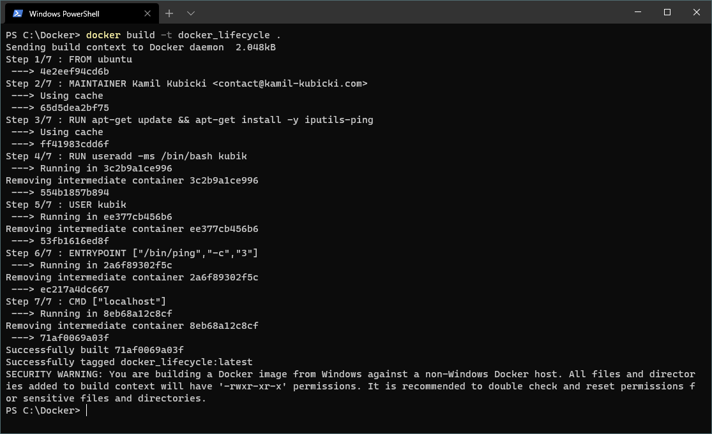

> docker images


***Progress:***
- [x] Prepare the Dockerfile
- [x] Edit Dockerfile
- [x] Build an Image
- [ ] Create container
- [ ] Start container
- [ ] Stop/Kill container
- [ ] Pause/Unpause container

---

#### Create container

> docker create --name="docker-lifecycle" docker_lifecycle 

* --name : assign a name to the container. In each part we will name the containers accordignly to the problem. Feel free to change this argument if you need.
* docker_lifecycle : 'docker_ubuntu' IMAGE_NAME


Docker returned long CONTAINER_ID `879c078d84868d6df416a25735c70717193764cd0e02813c4f06d062eb83ca5a` - for next use cases we can keep just first 10 characters for identifying the object. Let's list now all system containers: 

> docker ps

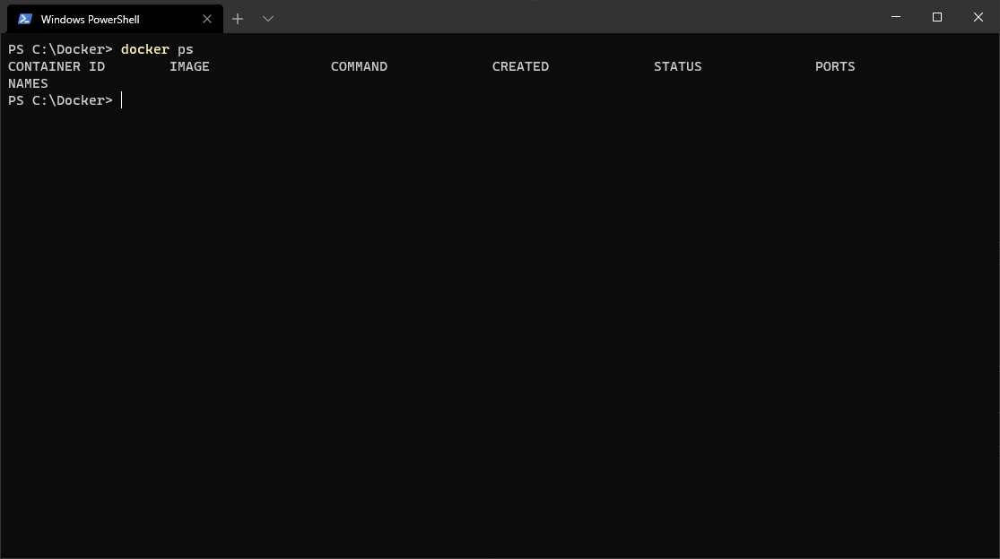

> *Command:*  
> `docker ps [OPTIONS]`
>
> *For more information:*  
> `docker ps --help`

Wait a moment - where is my container? The `docker ps` command shows only running containers. Keep calm, next command will make the thing:

> docker ps -a


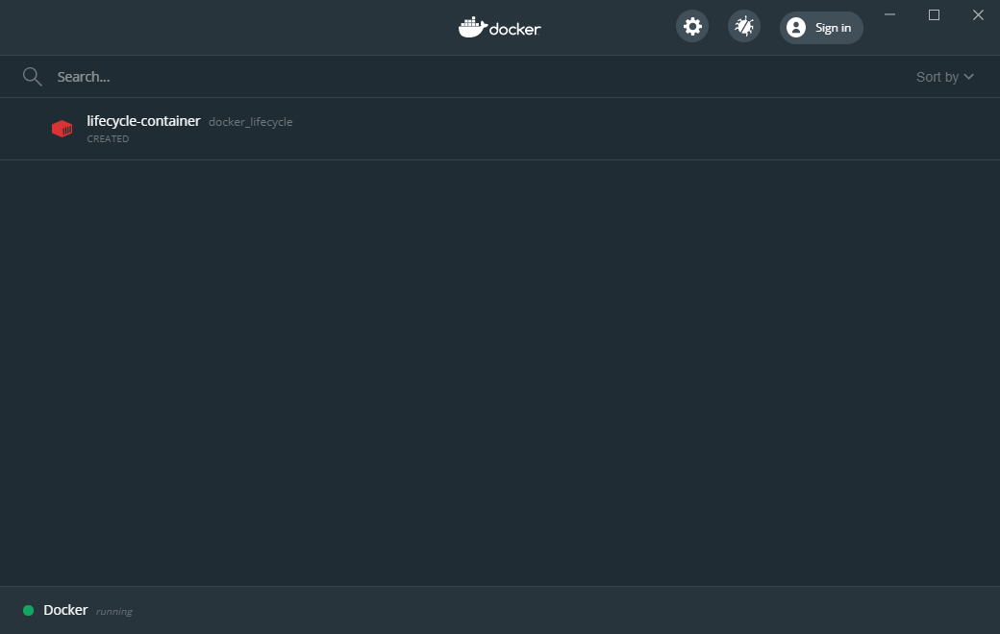

***Progress:***
- [x] Prepare the Dockerfile
- [x] Edit Dockerfile
- [x] Build an Image
- [x] Create container
- [ ] Start container
- [ ] Stop/Kill container
- [ ] Pause/Unpause container

---

#### Start container

We are ready to start the container using following command:

> docker start 879c078d8486

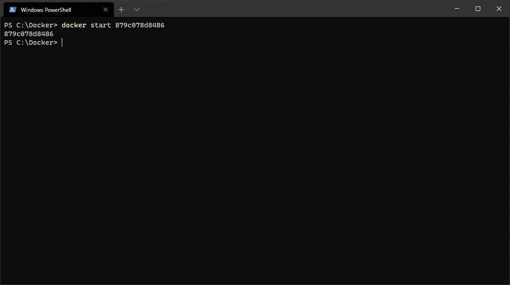


Surprised? Nothing happened? Why container stopped? Sorry to dissapoint you again, this is normal :). Container was running till last command finished then exited. All in background! That is why you didn't see anything. This trap was on purpose to show you that containers might be running behind the scene. Fortunately the solution is easy to implement directly in the command line. Enjoy!

> docker start -a 879c078d8486

* --attach , -a : attach STDOUT/STDERR and forward signals to the terminal's standard input, output, and error

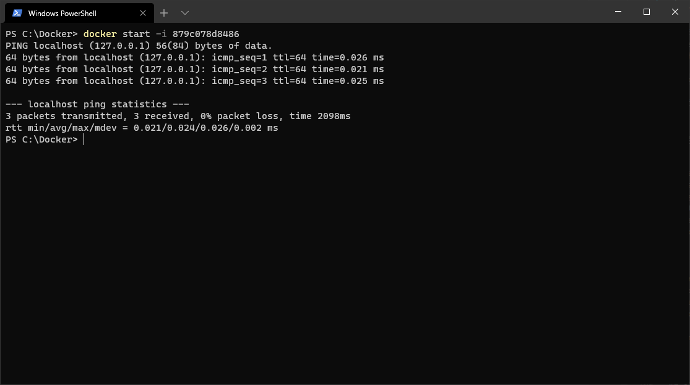

***Progress:***
- [x] Prepare the Dockerfile
- [x] Edit Dockerfile
- [x] Build an Image
- [x] Create container
- [x] Start container
- [ ] Stop/Kill container
- [ ] Pause/Unpause container

---

#### Stop/Kill container

No you know how to create and start a container, the time has come to see how to stop created object.
Please modify previously created Dockerfile with the code below - the ENTRYPOINT was removed as no longer needed for this example and CMD was remplaced with dummy `sleep` function (keeping alive con,tainer for 10 seconds after launch).

```
FROM ubuntu
MAINTAINER Kamil Kubicki <contact@kamil-kubicki.com>  
RUN apt-get update
RUN useradd -ms /bin/bash kubik
USER kubik
CMD ["sleep", "10"]
```
<cite>Source: [Dockerfile](src/dockerfiles/Dockerfile_Ubuntu_2)</cite>

Great job, lets test the feature - bad news is the IMAGE needs to be build again. Yes, do you remember from previous section? Each time layers change in Dockerfile, related Image needs to be notified about those modifications. Good news is the Docker is very performant and this will take us few seconds.

> docker build -t docker_lifecycle .

Done! Easy, isn't it? Let's create now a new container based on the new image structure (command will return unique CONTAINER_ID to use in future commands):

> docker create --name="lifecycle-container" docker_lifecycle  
> docker start a2487f86ec

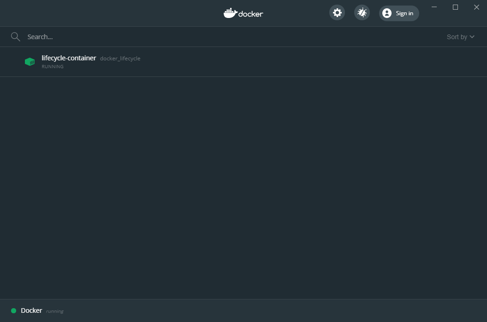

Executing the command, you will notice that the terminal returns immediately, however in Docker Dashboard our container is running for exactly 10 seconds. This is awsome. Let's go step further and comment last line of the Dockerfile (remember to rebuild the image straight after as its layers were modified):

```
FROM ubuntu
MAINTAINER Kamil Kubicki <contact@kamil-kubicki.com>  
RUN apt-get update
RUN useradd -ms /bin/bash kubik
USER kubik
# CMD ["sleep", "10"]
```

> docker build -t docker_lifecycle .

Please check closer, our container is based on Ubuntu image and as per its 5th layer it runs `/bin/bash` as default command:

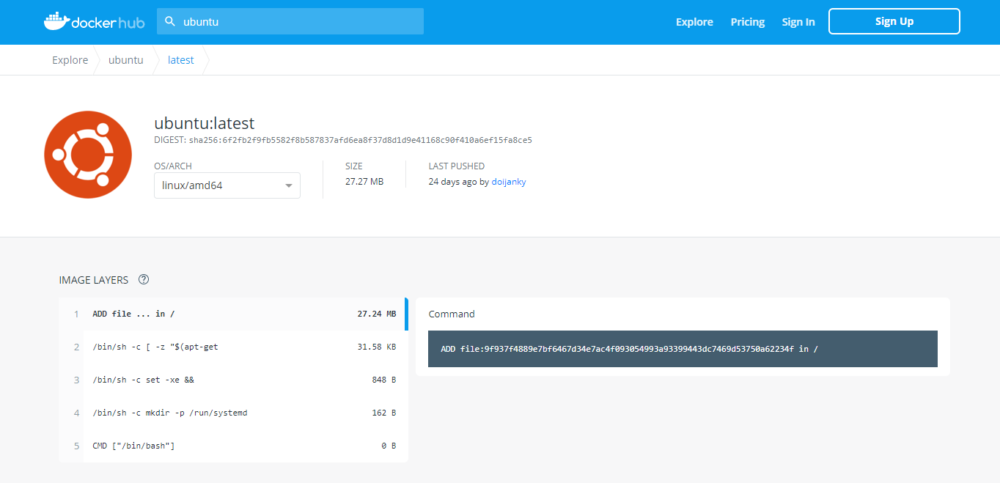
<cite>Source: [https://hub.docker.com](https://hub.docker.com) Ubuntu - Docker Official Image</cite>

It's Shell that listen for inputs (STDIN) from terminal (tty). This is crucial here to attach the terminal to the container as is not done by default, otherwise process will exit stopping the container.

> docker rm lifecycle-container  
> docker run --name lifecycle-container --rm -it docker_lifecycle

or

> docker rm lifecycle-container  
> docker create --rm --name="lifecycle-container" -it docker_lifecycle   
> docker start -i 7b32e46048af


First command removes the container to create another instance with the same name.
Second you are already familiar with, except:
* -i : interactive mode keeps STDIN open
* -t : allocate a pseudo-TTY

For the future, you can avoid removing the container manually by adding `-rm` option.
Now our container is running and you have acces to command line. As you can notice that `run` and `create` instructions are similar defining how launched object will behave.

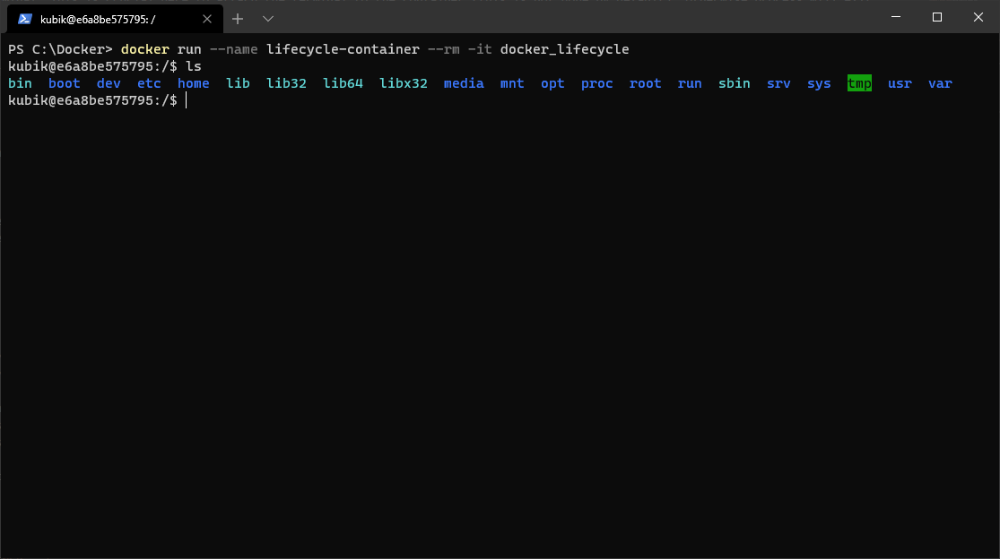


Containers can be stopped from command line or Docker Dashboard. Only running containers can be stopped and to do so you have two options: stop the services (clean solution, sends SIGTERM signal) or kill the services (force stoppping, sends SIGKILL signal). In both cases the object will no longer show up in the `docker ps` output.
When container is running in foreground, simple exit is enough to top the process. However if it's running in background, command line comes with helping hand.

The command below tries to stop running container, and if it fails after 30 seconds, SIGKILL signal will be sent to running object:

> docker stop -t 30 7b32e46048af

> *Command:*  
> `docker stop [OPTIONS] CONTAINER [CONTAINER...]`
>
> *Description:*  
> stop the container gracefully by sending a SIGTERM signal. In case when the container doesn't stop within a grace period, then a SIGKILL signal is sent
>
> *For more information:*  
> `https://docs.docker.com/engine/reference/commandline/stop/`

> *Command:*  
> `docker kill [OPTIONS] CONTAINER [CONTAINER...]`
>
> *Description:*  
> stop the container immediately by sending a SIGKILL signal
>
> *For more information:*  
> `https://docs.docker.com/engine/reference/commandline/kill/`

***Progress:***
- [x] Prepare the Dockerfile
- [x] Edit Dockerfile
- [x] Build an Image
- [x] Create container
- [x] Start container
- [x] Stop/Kill container
- [ ] Pause/Unpause container

---

#### Pause/Unpause container

If you don't want to stop all services but put them 'on hold' for a moment, `pause` command is a right choice.

> docker pause 7b32e46048af

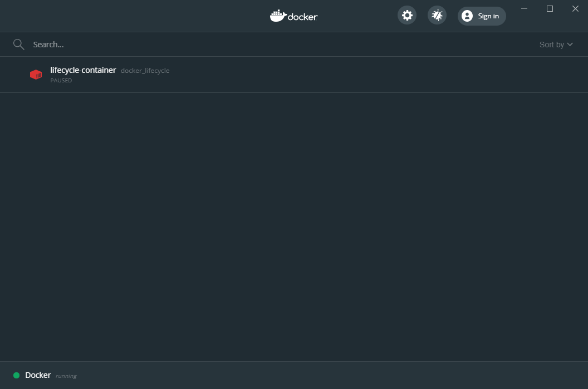

> *Command:*  
> `docker pause CONTAINER [CONTAINER...]`
>
> *Description:*  
> pause all processes within one or more containers

> *Command:*  
> `docker unpause CONTAINER [CONTAINER...]`
>
> *Description:*  
> unpause all processes within one or more containers

***Progress:***
- [x] Prepare the Dockerfile
- [x] Edit Dockerfile
- [x] Build an Image
- [x] Create container
- [x] Start container
- [x] Stop/Kill container
- [x] Pause/Unpause container

---

### Detached mode

You can start a Docker container in detached mode with a `-d` option, so the container starts up and run in background. That means, the terminal will be available for other commands attached to standard input, output and error. The opposite of detached mode is foreground mode (default mode), when `-d` option is not specified. Most of the time you will use detached mode to run a container. 

Next we will se a real life example using `-d` param:

- [ ] Running Nginx container
- [ ] Stop/Start container
- [ ] Dashboard comand line
- [ ] Exec container
- [ ] Delete container

---

#### Running Nginx container

> docker run -d --name nginx_container nginx

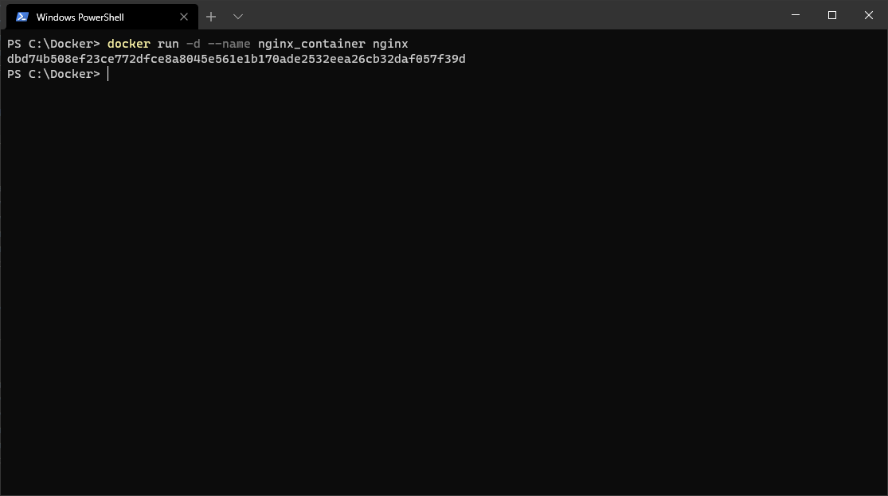


The 'nginx_container' container is running now in detached mode - we have access to Docker host command line.

- [x] Running Nginx container
- [ ] Stop/Start container
- [ ] Dashboard comand line
- [ ] Exec container
- [ ] Delete container

---

#### Stop/Start container

Let's use previously seen commands to stop/start running container - just to feel more familiar with:

> docker stop dbd74b508ef23c


> docker start dbd74b508ef23c


- [x] Running Nginx container
- [x] Stop/Start container
- [ ] Dashboard comand line
- [ ] Exec container
- [ ] Delete container

--- 

#### Dashboard comand line

Docker Desktop ships the Dashboard interface that enables you to interact with containers. We will try to take andvantage of its CLI on running nginx container. Please click on '>_' CLI button next to our 'nginx_container' - Voila! you are in, as simple as that.

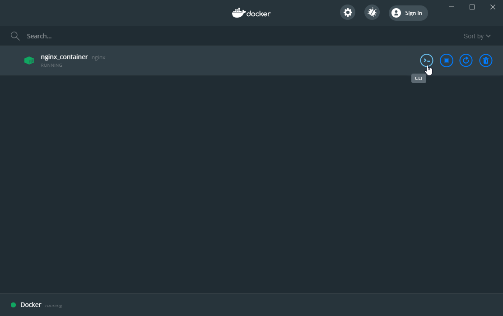

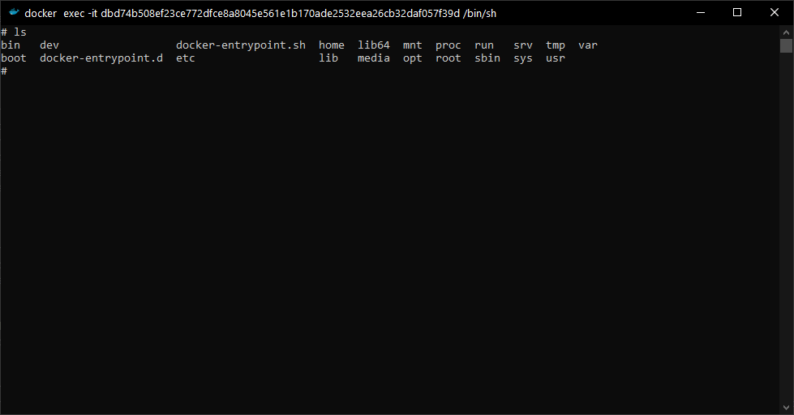

- [x] Running Nginx container
- [x] Stop/Start container
- [x] Dashboard comand line
- [ ] Exec container
- [ ] Delete container

--- 

#### Exec container

Did you notice something? Yes, Docker placed a command in terminal header that was used to open the interactive mode. 
Please close the CLI terminal now (type 'exit') and run this command manually - the result will be the same.

> docker exec -it dbd74b508ef23ce772dfce8a8045e561e1b170ade2532eea26cb32daf057f39d /bin/sh

> *Command:*  
> `docker exec [OPTIONS] CONTAINER COMMAND [ARG...]`
>
> *Description:*  
> run a command in a running container
>
> *For more information:*  
> `https://docs.docker.com/engine/reference/commandline/exec/`

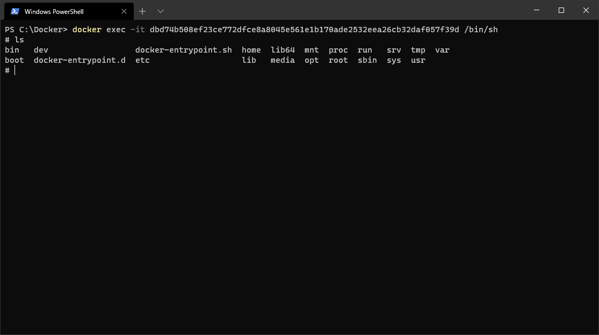

- [x] Running Nginx container
- [x] Stop/Start container
- [x] Dashboard comand line
- [x] Exec container
- [ ] Delete container

--- 

#### Delete container

Good practice is to clean up no longer used containers - this will free the disk space and avoid unexpected side effects:

> docker rm dbd74b508ef

- [x] Running Nginx container
- [x] Stop/Start container
- [x] Dashboard comand line
- [x] Exec container
- [x] Delete container

--- 

### Ports mapping

For security reasons, Docker doesn’t open container ports automatically to the outside world - those entry point need to be specified on runtime.

Nginx image will serve to illustrate the example of ports mapping. Please run the command below to start container in detached mode based on nginx image (by default nginx runs on port 80):

> docker run -d --name port_mapping nginx 


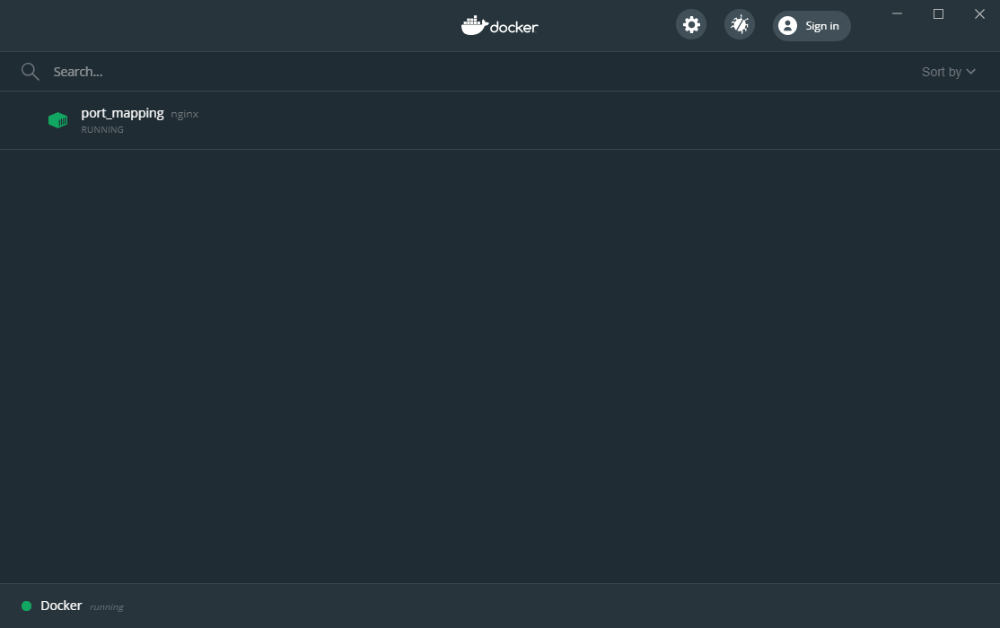

Try now to access 'http://localhost:80' in your favourite browser. For sure you will get a beautiful 102 Error ERR_CONNECTION_REFUSED because our container is inside an isolated environment. You need to map the port inside the Docker container to free port on Docker host to make it work.

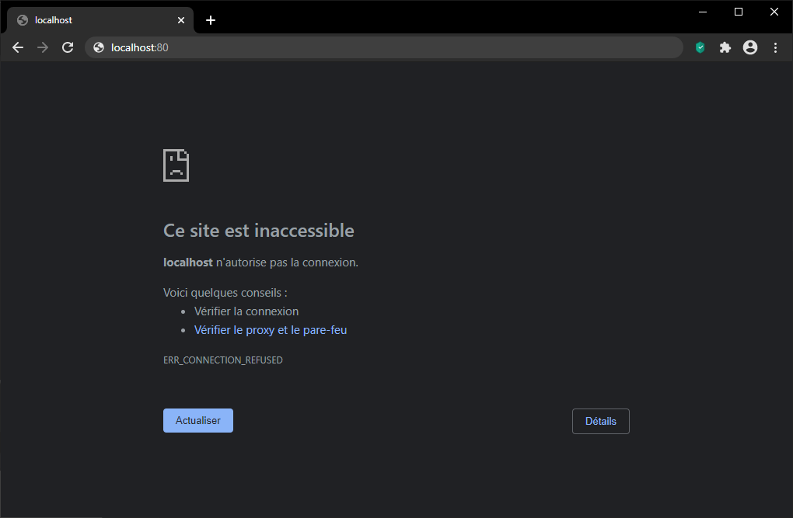

Now we will publish the ports using `--port` or `-p` option, such as `-p 8080:80`. This will map TCP port 80 in the container to port 8080 on the Docker host.

Try now to access 'http://localhost:8080' in your browser.

> docker rm port_mapping   
> docker run -d -p 8080:80 --name port_mapping nginx 

> *Command:*  
> `docker run -d -p HOST_PORT:CONTAINER_PORT nginx`
>
> *Description:*  
> map ports between host and container
>
> *For more information:*  
> `https://docs.docker.com/config/containers/container-networking/`

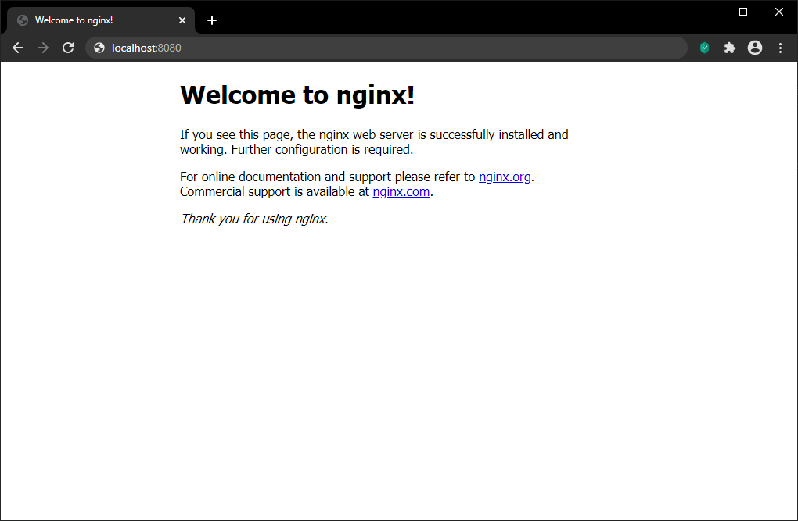

--- 

### Environment variables

We can define environment variables on several different levels:

- with .env file when working with docker-compose (this will be discussed later in this document) 
- on container run stage
- on image build stage

Environment variables can be shared with Docker images using ARG and ENV instructions:

- ENV - instruction used to declare environment variables. Instruction is available when running the container and during build time, however we can’t pass it while building the image and should use instead ARG instruction.
- ARG -  build-time instruction can be included in command line with `--build-arg` argument. ARG is the only instruction that may precede FROM in the Dockerfile. ARG and ENV can work together (example: ARG can set the default value of ENV variable).

In first scenario, we will discover the techique that relies on defining the arguments inside `run` bash command. Example will print on the screen just created variable:

> docker run --env VARIABLE_TEST=test nginx env

* --env , -e : set environment variables 
* env : command passed as argument to default CMD of Nginx image (/bin/bash) printing environment variables

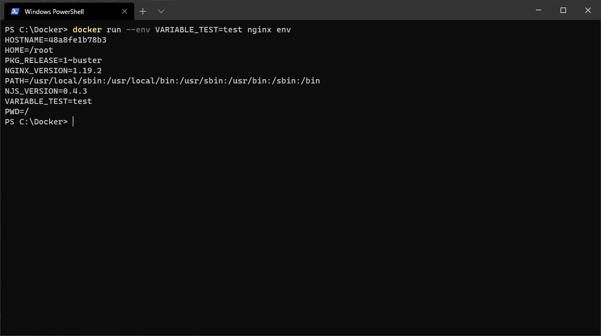

We can declare ENV instructions in Dockerfile as below:

Variable ENVIRONMENT is set with its default value (value is required here):   
> ENV ENVIRONMENT=dev

Variable ENVIRONMENT gets DEFAULT value from ARG that can be overwritten/or not in build stage (with `--build-arg` argument):

* required argument on build stage
> ARG ENVIRONMENT_ARG   
> ENV ENVIRONMENTX=$ENVIRONMENT_ARG

* default argument
> ARG ENVIRONMENT_ARG=dev   
> ENV ENVIRONMENTX=$ENVIRONMENT_ARG

<cite>

#### Note from official Docker documentation:

* Values present in the environment at runtime always override those defined inside the .env file. Similarly, values passed via command-line arguments take precedence as well.   

* Environment variables defined in the .env file are not automatically visible inside containers.

</cite>

<cite>More about: [https://docs.docker.com](https://docs.docker.com/compose/environment-variables/) Environment variables in Compose</cite>

### IMPORTANT: ARG and ENV instructions are not safe as leave marks in the Docker image and should not be use for secrets/credentials!

---

Now it's time to prepare some real example of using envioronment variables in Dockerfile:

- [ ] Prepare the Dockerfile
- [ ] Edit Dockerfile
- [ ] Build Images
- [ ] Run Nginx containers
- [ ] Tests
- [ ] Go further

#### Prepare the Dockerfile

1. create a new `docker_env` folder
2. create blank `Dockerfile` file inside `docker_env` directory
3. copy 'index_dev.html' and 'index_prod.html' files inside `docker_env` directory

<cite>Source: [index_dev.html](src/dockerfiles/index_dev.html)</cite>
<cite>Source: [index_prod.html](src/dockerfiles/index_prod.html)</cite>

- [x] Prepare the Dockerfile
- [ ] Edit Dockerfile
- [ ] Build Images
- [ ] Run Nginx containers
- [ ] Tests
- [ ] Go further

--- 

#### Prepare the Dockerfile
The image will be based on Nginx image pulled from Docker Official Images registry. 

```
FROM nginx
ARG ENVIRONMENT=index_dev.html
ENV ENVIRONMENT_INDEX=$ENVIRONMENT
COPY ./${ENVIRONMENT_INDEX} /usr/share/nginx/html/index.html
```
<cite>Source: [Dockerfile](src/dockerfiles/Dockerfile)</cite>

- [x] Prepare the Dockerfile
- [x] Edit Dockerfile
- [ ] Build Images
- [ ] Run Nginx containers
- [ ] Tests
- [ ] Go further

--- 

#### Build Images
In this example we will build two images - one for 'dev' and other for 'prod':

> docker build -t docker_nginx_dev .  

> docker build --build-arg ENVIRONMENT=index_prod.html -t docker_nginx_prod .

- [x] Prepare the Dockerfile
- [x] Edit Dockerfile
- [x] Build Images
- [ ] Run Nginx containers
- [ ] Tests
- [ ] Go further

--- 

#### Run Nginx containers
Well done! Time to create the containers based on previously elaborated images (please pay attention to `-p` attribute and port mapping):

> docker run --rm -d -p 8080:80 --name environment_dev docker_nginx_dev

> docker run --rm -d -p 8085:80 --name environment_prod docker_nginx_prod

- [x] Prepare the Dockerfile
- [x] Edit Dockerfile
- [x] Build Images
- [x] Run Nginx containers
- [ ] Tests
- [ ] Go further

--- 

#### Tests
Time to test our work. Please visit both adresses listed below - that's it. Both pages uses different ports and 'Welcome index.html' files defined on runtime:

> http://localhost:8080  
>
> 

> http://localhost:8085
>
> 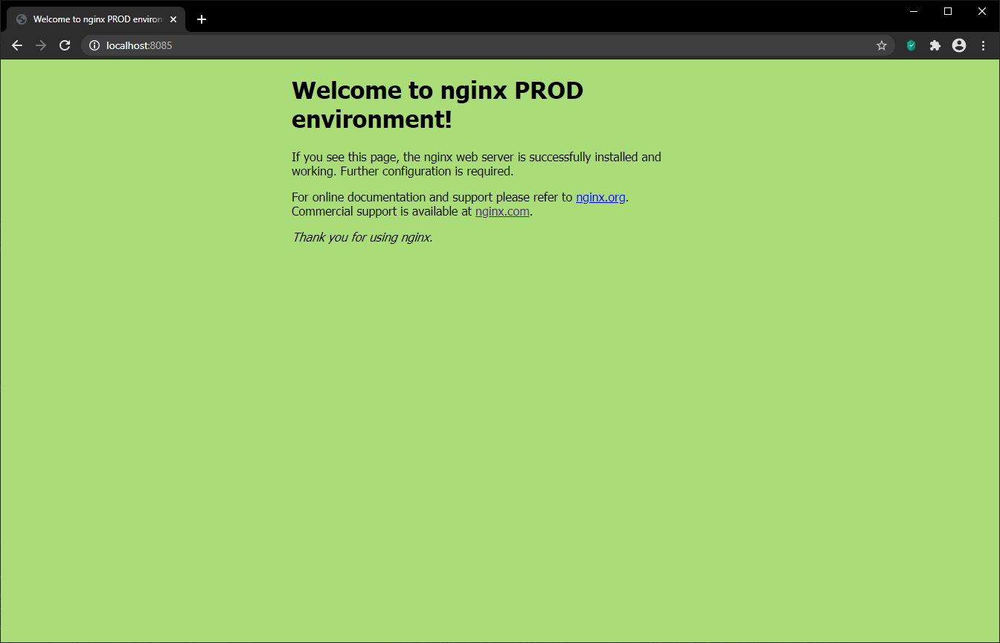

- [x] Prepare the Dockerfile
- [x] Edit Dockerfile
- [x] Build Images
- [x] Run Nginx containers
- [x] Tests
- [ ] Go further

--- 

####  Go further

Ready for another example? Please edit Dockerfile's content in `docker_env` directory and run the commands below - both will create an IMAGE:VERSION related to instruction passed with ARG parameter: 

```
ARG VERSION=latest
FROM ubuntu:${VERSION}
```
<cite>Source: [Dockerfile](src/dockerfiles/Dockerfile_Ubuntu_3)</cite>

> docker build -t image_latest .  
> docker build --build-arg VERSION=14.04 -t image_14.04 .
> docker image ls

> 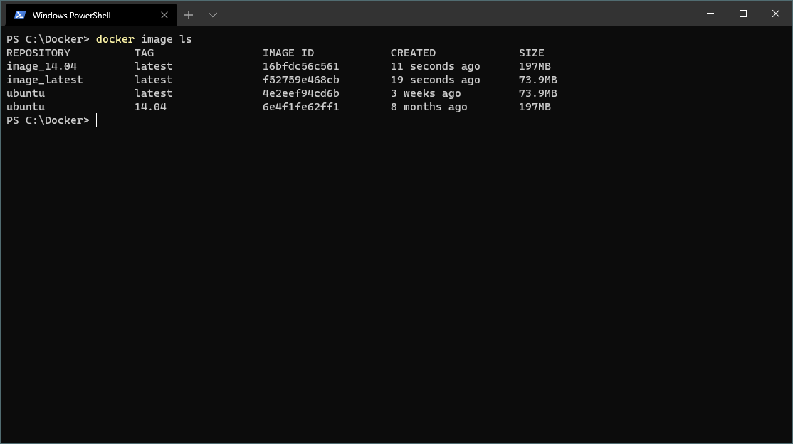

- [x] Prepare the Dockerfile
- [x] Edit Dockerfile
- [x] Build Images
- [x] Run Nginx containers
- [x] Tests
- [X] Go further

--- 

### Logs & stats

#### Stats

Docker shipps live data stats of running containers:

> docker run -d --name nginx_container nginx

Previous line will return new CONTAINER_ID, please use it with next command (if you want to list all containers with their IDs, please use `docker ps -a` command instead):

> docker stats CONTAINER_ID

- CPU : % of CPU container consuming

- MEM : % of memory container consuming

- MEM USAGE / LIMIT : memory the container is using vs memory it is allowed to use

- NET I/O : data the container has sent and received

- BLOCK I/O : data the container has read to and written from block devices on the host

- PIDs They are the number of processes or threads the container has created

> *Command:*  
> docker stats [OPTIONS] [CONTAINER...]
>
> *Description:*  
> live data stream for running containers
>
> *For more information:*  
> `https://docs.docker.com/engine/reference/commandline/stats/`

> 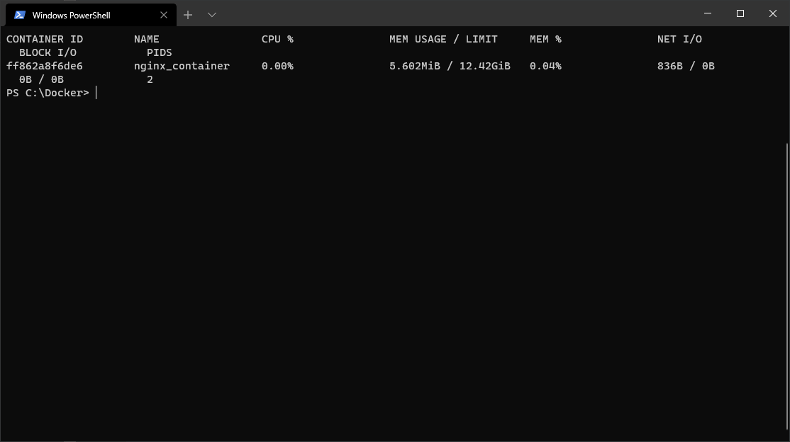

#### Logs

We can also get some logs from a running container. Here is the syntax for the command:

> docker logs CONTAINER_ID

> *Command:*  
> docker logs [OPTIONS] [CONTAINER...]
>
> *Description:*  
> logs present at the time of execution.
>
> *For more information:*  
> `https://docs.docker.com/engine/reference/commandline/logs/`

> 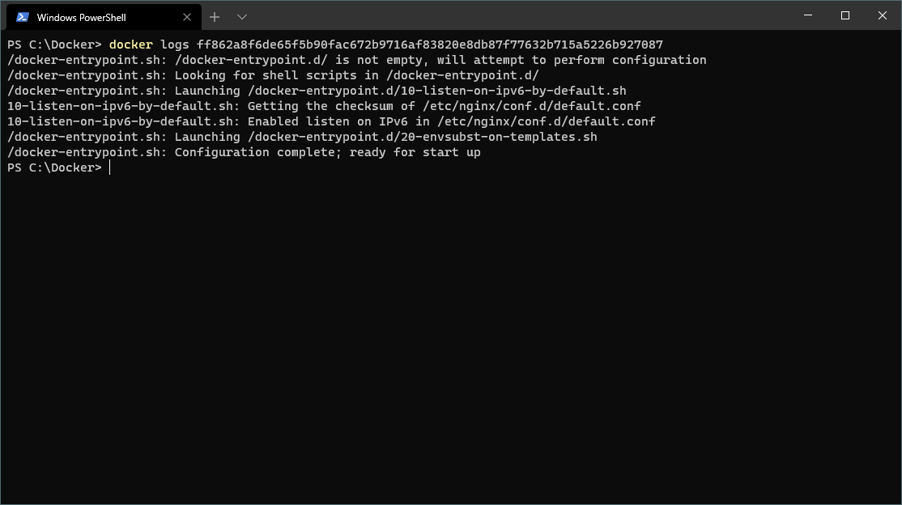

#### Diff

Docker has a layered filesystem making available tracking file changes inside a container:

> docker diff  CONTAINER_ID

* A stands for 'added' 
* B stands for 'changed'
* D stands for 'deleted'

> *Command:*  
> docker diff CONTAINER
>
> *Description:*  
> Inspect changes to files or directories on a container’s filesystem
>
> *For more information:*  
> `https://docs.docker.com/engine/reference/commandline/diff/`

> 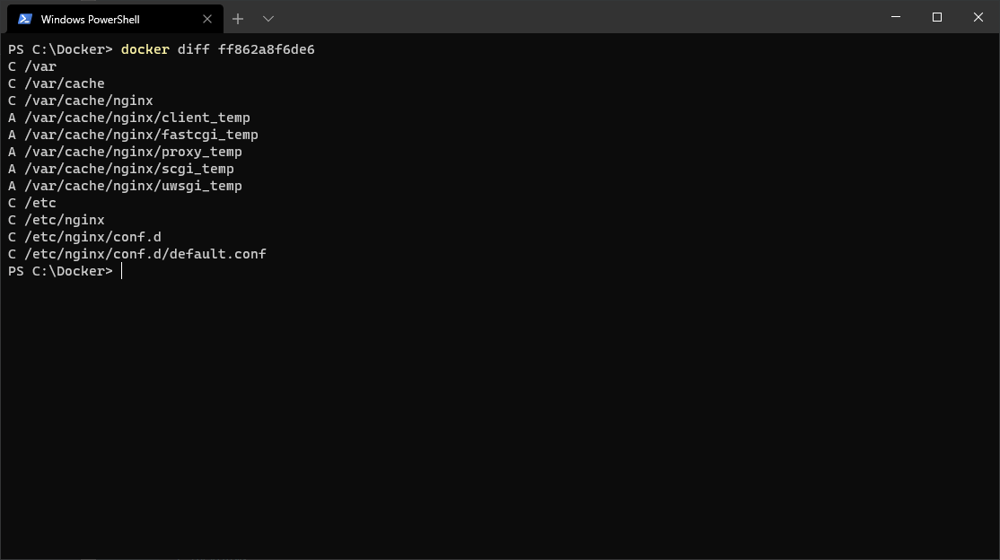

-- --------------------

## Quiz

<details>
<summary> What is the command that lists all running containers ?</summary>

> *Command:*  
> `docker ps`  

</details>

<details>
<summary> How to run a container in detached mode ?</summary>

> *Command:*  
> `docker run -d --name CONTAINER_NAME IMAGE_NAME `  

</details>

<details>
<summary> How to list all containers ?</summary>

> *Command:*  
> `docker ps -a`  

</details>

<details>
<summary> What is the command to map host's port 80 to container's port 80 for Nginx image ?</summary>

> *Command:*  
> `docker run -d -p 80:80 nginx `  

</details>

<details>
<summary> How to stop running container ?</summary>

> *Command:*  
> `docker ps` : to list running containers and to get CONTAINER_ID / CONTAINER_NAME   
> `docker stop CONTAINER_ID / CONTAINER_NAME ` 

</details>

<details>
<summary> How to get a detailed information about a container ?</summary>

> *Command:*  
> `docker inspect CONTAINER_ID`  

</details>

<details>
<summary> How to display an IP address inside a running container ?</summary>

> *Command:*  
> `hostname -i`  

</details>

<details>
<summary> How to display a Container ID inside a running container ?</summary>

> *Command:*  
> `hostname -f`  

</details>

<details>
<summary> How to display a Container ID in detached mode ?</summary>

> *Command:*  
> ` docker inspect -f '{{.NetworkSettings.IPAddress}}' CONTAINER_ID`  

</details>

<details>
<summary> What is the command removing a running container ?</summary>

Wow! You should not remove a running container! However if you would like to do so:

> *Command:*  
> `docker rm -f CONTTAINER_ID`  

</details>

<details>
<summary> Why some containers stop immediately after running ? </summary>

Container's job is to run a task and not whole operating system. If there is no process to be run, container accomplished its job and will exit.
</details>

<details>
<summary> What is the difference between ENTRYPOINT and CMD ? </summary>

- ENTRYPOINT indicates a command that will be executed when the container starts.

- CMD defines arguments for ENTRYPOINT.

</details>

<details>
<summary> How to get 10 last log lines for given container ? </summary>

> *Command:*  
> `docker logs CONTTAINER_ID --tail 10`  

</details>