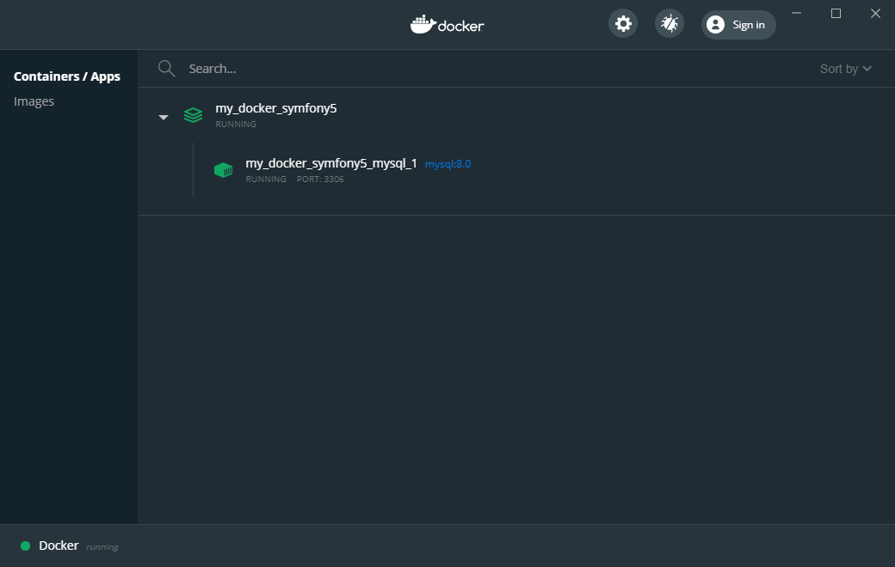
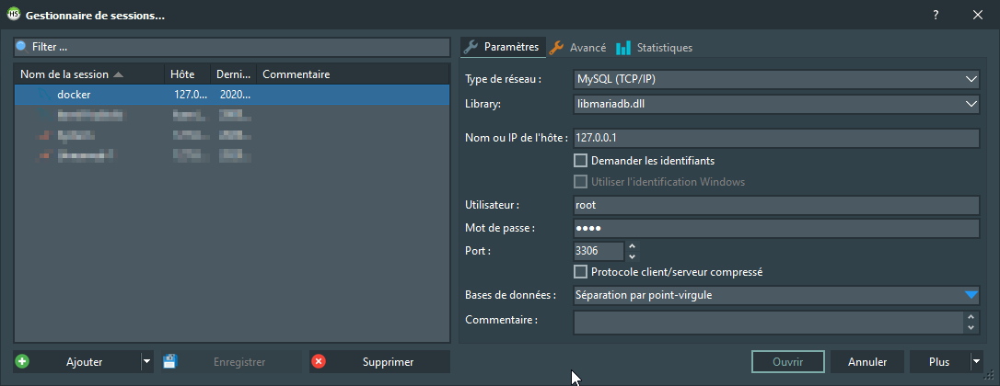
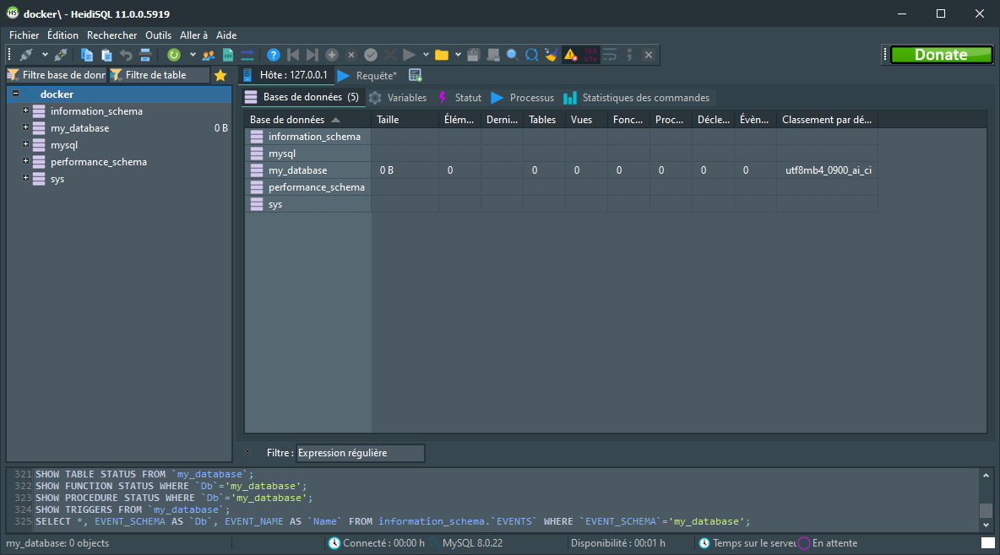
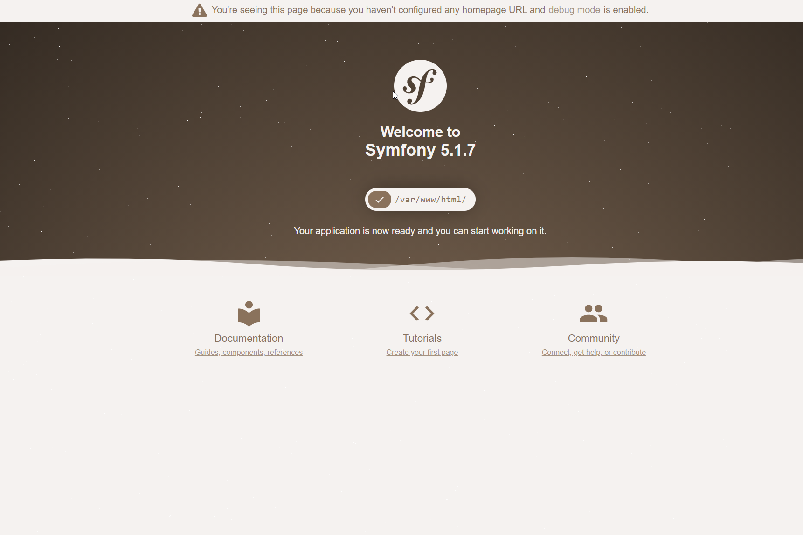

[< BACK ](../../README.md)

## Symfony & React meet Docker

- [Dockerize Symfony5](#Dockerize-Symfony5)
    - [Create Symfony 5 project](#Create-Symfony-5-project)
    - [Prepare docker-compose.yml](#Prepare-docker_-_compose.yml)
    - [Add mysql service](#Add-mysql-service)
    - [Add apache service](#Add-apache-service)
    - [Add php service](#Add-php-service)
    - [Add nodejs service](#Add-nodejs-service)
    - [Run the stack](#Run-the-stack)
   

### Dockerize Symfony5

In previous part of the tutorial we discovered Docker Compose CLI and learned how to run several containers under one stack.

This time we will go step further and try to orchestrate below services:

- Symfony 5
- MySql
- apache2
- php
- nodejs

Creating docker-compose.yml with all the components your dev requires have several advantages:

- you will never hear the phrase 'That is strange - locally this works fine...'
- docker helps you develop and validate the code in an environment close to production
- you won't need to install libraries with different versions directly on the host machine 
- any new developer will be able to deploy the project in a minute
- while developing on Windows machine you can take advantage of Linux container ecosystem
- and more...


- [ ] Create Symfony 5 project
- [ ] Prepare docker-compose.yml
- [ ] Add mysql service
- [ ] Add apache service
- [ ] Add php service
- [ ] Add nodejs service
- [ ] Run the stack

---

### Create Symfony 5 project

We need a root directory where will be placed our Symfony 5 project:

1. download and install Symfony CLI from https://symfony.com/download
2. create new SF5 project with commend `symfony new docker-symfony5`

***Progress:***
- [x] Create Symfony 5 project
- [ ] Prepare docker-compose.yml
- [ ] Add mysql service
- [ ] Add apache service
- [ ] Add php service
- [ ] Add nodejs service
- [ ] Run the stack

---

### Prepare docker-compose.yml

1. create blank `docker-compose.yml` file inside `docker-symfony5`
2. create a new folder named `.docker` (Dockerfiles and other services elements will be placed here)
3. create Docker config parameters inside .env file
4. add initial parameters

```diff
//.env
...
###> Docker config ###
COMPOSE_PROJECT_NAME=my_docker_symfony5
###< Docker config ###
```

By default Compose sets up a single network for the app based on the project name root directory.
Using .env setting we can overwrite it and skip 'networks' settings (however if you plan to use some custom networks inside the stack, feel free to add them).

```diff
version: '3.8'
services:
#  mysql:
#  apache:
#  php:
#  nodejs:
# This can be skipped as defined in COMPOSE_PROJECT_NAME
# networks:
#  web:
``` 
 
***Progress:***
- [x] Create Symfony 5 project
- [x] Prepare docker-compose.yml
- [ ] Add mysql service
- [ ] Add apache service
- [ ] Add php service
- [ ] Add nodejs service
- [ ] Run the stack

---

#### Add mysql service

Let's set our first MySQL service:

```diff
version: '3.8'
services:
+  mysql:
+    image: mysql:8.0
+    ports:
+      - 3306:3306
+    volumes:
+      - ./.docker/mysql/config/mysql-docker.cnf:/etc/mysql/conf.d/mysql-docker.cnf:ro
+      - ./.docker/mysql/config/init-db.sql:/docker-entrypoint-initdb.d/init-db.sql:ro
+      - ./.docker/mysql/log/:/var/log/mysql:rw
+    restart: always
+    environment:
+      MYSQL_ROOT_PASSWORD: ${MYSQL_ROOT_PASSWORD}
+      MYSQL_DATABASE: ${MYSQL_DATABASE}
+      MYSQL_USER: ${MYSQL_USER}
+      MYSQL_PASSWORD: ${MYSQL_PASSWORD}
#  apache:
#  php:
#  nodejs:
# This can be skipped as defined in COMPOSE_PROJECT_NAME
# networks:
#  web:
``` 

Most of params were covered in 'docker-compose' chapter, except environment ones that need to be mapped to the .env configuration as below:

```diff
//.env
...
###> Docker config ###
COMPOSE_PROJECT_NAME=my_docker_symfony5
+ MYSQL_ROOT_PASSWORD=root
+ MYSQL_USER=user
+ MYSQL_PASSWORD=pass
+ MYSQL_DATABASE=my_database
###< Docker config ###
```

Wow, wait! - what are those volumes. Do we really need it?
Well, yes I suppose - not all probably but some for sure, as container not persist the state and data not kept on host side can be vanished.
Docker mounts host directories/volumes from the project at target paths inside the container (or creates them on host side if they don’t exist).
This is a brilliant way to prepare and load initial configuration directly inside the container. 

> Mysql custom configuration
> ./docker/mysql/config/mysql-docker.cnf:/etc/mysql/conf.d/mysql-docker.cnf:ro
> :ro volume mounted as read-only on container side
> ATT: on WINDOWS :re files need to be marked as read-only to avoid any issues!
>
<cite>Source: [mysql-docker.cnf](src/mysql/mysql-docker.cnf)</cite>

> Mysql initial query/instructions loaded when service starts
> ./docker/mysql/dev/init-db.sql:/docker-entrypoint-initdb.d/init-db.sql:ro
> :ro volume mounted as read-only on container side
> ATT: on WINDOWS :re files need to be marked as read-only to avoid any issues!
>
<cite>Source: [init-db.sql](src/mysql/init-db.sql)</cite>

> Mysql global store - you should have a look inside. This guarantee your data is safe in case container crashes.
> ./docker/mysql/data/:/var/lib/mysql:rw
> :rw volume mounted as read-write on container side

> Logs
> ./docker/mysql/log/:/var/log/mysql:rw

We could also define custom networks & container name that was skipped using `COMPOSE_PROJECT_NAME` parameter.

```
services:
  mysql:
    ...
# This can be skipped as defined in COMPOSE_PROJECT_NAME
#    container_name: custom_mysql_container_name
#    networks:
#      - web
```

Our file is ready now, and the time has come to run the magic command: 
 
> docker-compose up -d



Try to verify connection between the host machine and MySQL container using .env credentials:




      
Voila!       

***Progress:***
- [x] Create Symfony 5 project
- [x] Prepare docker-compose.yml
- [x] Add mysql service
- [ ] Add apache service
- [ ] Add php service
- [ ] Add nodejs service
- [ ] Run the stack

---

### Add apache service

Next step will consist of placing an apache server in the stack - we will use a Debian Linux distribution in version 10 to make it happen:

```
services:
    ...
+  apache:
+    build: ./.docker/apache
+    ports:
+      - 8080:80
+    volumes:
+      - ./public:/var/www/html/public:ro
+      - ./.docker/apache/config/vhosts.conf:/etc/apache2/sites-enabled/vhosts.conf:ro
+    depends_on:
+      - php
```

> build: ./.docker/apache :
> path where the Docker file will be pulled from to create apache image
>
<cite>Source: [Dockerfile](src/apache/Dockerfile)</cite>

> Symfony 5 index.php defines web entry point
> ./public:/var/www/html/public:ro
> :ro volume mounted as read-only on container side

> Apache configuration
> ./.docker/apache/vhosts.conf:/etc/apache2/sites-enabled/vhosts.conf:ro
> :ro volume mounted as read-only on container side
> ATT: on WINDOWS :re files need to be marked as read-only to avoid any issues!
>
<cite>Source: [vhosts.conf](src/apache/vhosts.conf)</cite>

Wait! Please do not run the magic command. If you look closely, there is also dependency `depends_on:`.
We wil need to setup PHP service first and run it together.

***Progress:***
- [x] Create Symfony 5 project
- [x] Prepare docker-compose.yml
- [x] Add mysql service
- [x] Add apache service
- [ ] Add php service
- [ ] Add nodejs service
- [ ] Run the stack

---

### Add php service

PHP service will be built on php-7.4-fpm-alpine. This image ships with the default php.ini-development and php.ini-production configuration files.
Att: This tutorial defines development stack, and it is strongly advised to define the production config if you wish to run it in production environment.

```
services:
    ...
+  php:
+    build:
+      context: .
+      dockerfile: ./.docker/php/Dockerfile
+    environment:
+      APP_ENV: ${APP_ENV}
+      MYSQL_HOST: mysql
+      MYSQL_PORT: 3306
+    volumes:
+      - .:/var/www/html:rw
+      - ./.docker/php/logs:/app/var/logs:rw
+    depends_on:
+      - mysql
```

> While mounting process an *.sh file is run, the context 
> and dockerfile should be defined in explicit way
> build:
>    context: .
>    dockerfile: ./.docker/php/Dockerfile

> depends_on: dependency between services and mounting order, however not guarantee that required service is fully running.
> ENTRYPOINT as part of Dockerfile (discovered in first chapter) helps to solve this issue. Using custom docker-entrypoint.sh 
> we can listen the service we depend on and proceed only if is fully operational. Environment arguments help to point out the 
> required service - here php waits for mysql:3306.
>   environment:
>      APP_ENV: ${APP_ENV}
>      MYSQL_HOST: mysql
>      MYSQL_PORT: 3306
>
<cite>Source: [docker-entrypoint.sh](src/php/docker-entrypoint.sh)</cite>

> Att: Working on WINDOWS machine, please replace all end of line characters (CRLF to LF):
> Click on Search > Replace (or Ctrl + H)
> Find what: \r\n.
> Replace with: \n.
> Search Mode: select Extended.

> Dockerfile pulls php image and install all dependencies pointing on docker-entrypoint.sh to run composer install inside container
> Skipped: The default config can be customized by copying configuration files into the $PHP_INI_DIR/conf.d/ directory.
>
<cite>Source: [Dockerfile](src/php/Dockerfile)</cite>

All our services defined till now are fully operational.
 
> docker-compose up -d


***Progress:***
- [x] Create Symfony 5 project
- [x] Prepare docker-compose.yml
- [x] Add mysql service
- [x] Add apache service
- [x] Add php service
- [ ] Add nodejs service
- [ ] Run the stack

---

### Add nodejs service

Trying to separate each level of our stack, NodeJs v15 is installed as new service - for now there is no js dependency defined or requirement in project:

```
services:
    ...
+  nodejs:
+    build:
+      context: .
+      dockerfile: ./.docker/nodejs/Dockerfile
+    volumes:
+      - .:/var/www/html:rw
+    depends_on:
+      - php
```
 
> docker-compose up -d


***Progress:***
- [x] Create Symfony 5 project
- [x] Prepare docker-compose.yml
- [x] Add mysql service
- [x] Add apache service
- [x] Add php service
- [x] Add nodejs service
- [ ] Run the stack

---

### Run the stack

Lets run the last time out docker-compose command:

> docker-compose up -d
>
Please visit: http://127.0.0.1:8080/



***Progress:***
- [x] Create Symfony 5 project
- [x] Prepare docker-compose.yml
- [x] Add mysql service
- [x] Add apache service
- [x] Add php service
- [x] Add nodejs service
- [x] Run the stack

#### Helpful commands:

Builds, (re)creates, starts, and attaches to containers for a service.
- docker-compose up -d
- docker-compose up -d --no-deps --build mysql
- docker-compose up -d --no-deps --build apache
- docker-compose up -d --no-deps --build php
- docker-compose up -d --no-deps --build nodejs

#### Direct access to Container's service:

- docker-compose exec php bash
- docker-compose exec php composer install